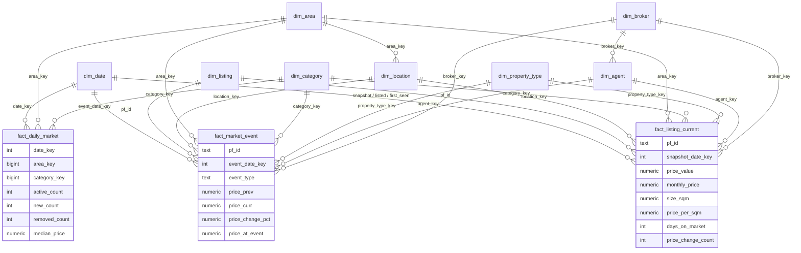

# Gold data model (star schema)

The Gold layer is a set of **plain views** in the Postgres schema `gold`. It is
defined in [`sql/gold_star_schema.sql`](../sql/gold_star_schema.sql) and
validated by [`sql/gold_checks.sql`](../sql/gold_checks.sql). It stores no
data, so it costs nothing on the free-tier storage budget.

## Layers in this repo

| Layer | Where | What |
|---|---|---|
| **Bronze** | `data/raw_archive/YYYY-MM-DD/*.json.gz` | Raw `__NEXT_DATA__` payloads per category, gzip, committed to git. Re-cleanable at any time. |
| **Silver** | Postgres `public.listings`, `listing_status`, `listing_changes`, `daily_stats`, `load_runs` (written by `scripts/load_to_db.py`) | Cleaned, typed, **diff-based** history: one row per listing, a presence row per listing, one row per changed field per day, daily aggregates. |
| **Gold** | Postgres schema `gold` (this document) | Star schema for BI / APIs: conformed dimensions + three fact views, integer keys, no personal contact data. |

## Apply / validate

```bash
psql "$SUPABASE_DB_URL" -v ON_ERROR_STOP=1 -f sql/gold_star_schema.sql   # idempotent, one transaction
psql "$SUPABASE_DB_URL" -f sql/gold_checks.sql                          # every check row must say pass = t
```

Requirements: the Silver tables must exist, so the loader has to have run at
least once. **The schema requires PostGIS.** `dim_listing` selects
`listings.geom`, and the loader only creates that column when PostGIS was
available at load time. Without it, applying the file fails. Supabase has
PostGIS, so this holds there. Re-run the
schema file after any change to it; it re-applies the privilege revokes each
time. `CREATE OR REPLACE VIEW` can only *append* columns. To rename or drop a
column, add `DROP VIEW IF EXISTS gold.<view> CASCADE;` above the definition.
Dependent views are recreated further down the same file, but any grants to
an API role have to be re-applied.

## Conventions

- **Keys** are `BIGINT` (`dim_date.date_key` is `INTEGER` `YYYYMMDD`; `dim_listing` is keyed by `pf_id TEXT`).
  - Clean numeric natural ids are used as-is: `location_id`, `property_type_id`, `agent_id`, `broker_id`.
  - Text natural keys use a deterministic 64-bit md5 hash, `('x'||left(md5(text),16))::bit(64)::bigint`. This covers `area_name` and `category_name` (the keys `daily_stats` uses), developer UUID `broker_id`s, and new-project text property types.
  - Every dimension has an **Unknown member with key -1** (`pf_id '(unknown)'` in `dim_listing`), and fact FKs are never NULL.
- **Dates** are UTC calendar dates, which is the same convention as the loader's `snapshot_date`.
- **Currency** is BHD. Rent in Bahrain PF is always `price_period = 'monthly'` today. The facts still normalise `yearly`/`weekly`/`daily` to monthly defensively. `size_unit` is always `sqm` today, and `sqft` would be converted.
- **Dimension attributes are "current"** (SCD type 1).
  - `dim_location`, `dim_agent`, `dim_broker`, `dim_category` and `dim_property_type` take their attributes from the most recently seen listing row.
  - `dim_area` is the exception: it takes the most frequent `area_id`/region per `area_name`, preferring rows that have an id, not the latest-seen row.
  - Facts get their dimension keys from the listing's current attributes, including for historical events.
- **"Today"** is `(now() AT TIME ZONE 'UTC')::date` everywhere in gold, so the result does not depend on the session time zone.
- **Security.** Every view is `WITH (security_invoker = true)`. `PUBLIC`, `anon` and `authenticated` get no privileges on the schema or on any view, and `gold` is not a PostgREST-exposed schema, so nothing is visible through the Supabase REST API. The Silver tables have RLS enabled with no policies. A non-owner role therefore sees 0 rows through gold, even if it is granted the views, until an RLS policy or `BYPASSRLS` is set up deliberately.
- **No PII.** The gold views never select `agent_email`, `agent_image`, `contact_*`, `broker_email`, `broker_phone`, `broker_address` or the free-text `description`. This is enforced by a check in `gold_checks.sql`. "No PII" means no structured contact columns: free text such as `title` is not scrubbed and may contain phone numbers.

## Views

### Dimensions

| View | Grain / key | Columns |
|---|---|---|
| `dim_date` | one calendar day, `date_key` (YYYYMMDD) | date, day, day_name, iso_day_of_week, **is_weekend** (Fri+Sat, the Bahrain weekend), iso_week, iso_year, month, month_name, quarter, year, year_month. Range: earliest date in the data → max(today UTC, latest listed/last-seen/change/stat date) + 30. |
| `dim_area` | area (~100), `area_key` = hash(area_name) | area_id, area_name, region_id, region_name (governorate). The grain of `fact_daily_market` and the roll-up of `dim_location`. |
| `dim_location` | PF `location_id` (~160, leaf of the location tree), `location_key` = location_id | location_name, location_type (AREA/COMMUNITY/TOWER), location_full_name, location_path_name, community, sub_community, **area_key** → dim_area, area_id, area_name, region_id, region_name |
| `dim_category` | category (5), `category_key` = hash(category_name) | category_id, category_name, category_label, **segment** (residential / commercial / new_projects), **offering** (rent / sale) |
| `dim_property_type` | PF `property_type_id` (~22 + project multi-types), `property_type_key` | property_type_id, property_type, is_multi_type (new-project strings such as `apartment\|penthouse`) |
| `dim_broker` | `broker_id` (agency; developer for new projects), `broker_key` | broker_name, broker_slug, is_developer, broker_is_exclusive, broker_license_number, broker_total_properties/agents/super_agents |
| `dim_agent` | `agent_id`, `agent_key` | agent_name, agent_slug, is_super_agent, agent_position, agent_languages, years_experience, total_properties, transactions_count, whatsapp_response_time, **broker_key** → dim_broker, broker_id, broker_name |
| `dim_listing` | `pf_id`, every listing ever seen | listing_id, title, bedrooms_value, is_studio, bathrooms_value, size_value, size_unit, furnished, completion_status, latitude, longitude, geom, listed_date, first_seen_date, last_seen_date, is_active, share_url, and FKs location_key, area_key, category_key, property_type_key, agent_key, broker_key |

### Facts

| View | Grain | FKs | Measures |
|---|---|---|---|
| `fact_listing_current` | one row per **active** listing at the latest `load_runs.snapshot_date` | pf_id, snapshot_date_key, listed_date_key, first_seen_date_key, location_key, area_key, category_key, property_type_key, agent_key, broker_key | price_value, price_period, price_is_hidden, **monthly_price** (rent only), **size_sqm**, **price_per_sqm** (rent: monthly/sqm; sale: price/sqm), **days_on_market** (snapshot − first_seen), days_on_market_censored, days_since_listed, price_change_count, last_price_change_date |
| `fact_market_event` | one row per listing × day × event (`listing_changes` where field ∈ `_status`, `price_value`) | pf_id, event_date_key, location_key, area_key, category_key, property_type_key, agent_key, broker_key | event_date, **event_type** (new / removed / relisted / price_changed), price_prev, price_curr, price_change, price_change_pct, **price_at_event** (the price in force that day, from a per-listing price timeline: the nearest change on or before the day, else the nearest change after it, else the current price), event_count (=1) |
| `fact_daily_market` | day × category × area (from `daily_stats`) | date_key, area_key, category_key | active_count, new_count, removed_count (additive); avg_price, median_price (not additive) |

`gold.listing_base` is an internal building block: one row per `pf_id` with
every key resolved once, so all dims and facts agree on keys. Don't expose it.

### Caveats

- `days_on_market` counts days since the pipeline first saw the listing.
  Listings already live on the first loaded day (2026-06-09) are left-censored
  and flagged with `days_on_market_censored`.
- Price outliers come through from the source unfiltered: rent of 1 BHD or
  400,000 BHD/month, and sale price/sqm above 1M on listings with a 1 sqm size.
  Filter or winsorise in the consuming query.
- `fact_listing_current.area_key` uses the listing's own `area_name`, which
  matches `daily_stats`. For a handful of new-project rows this differs from
  `dim_location.area_key` for the same location_id (e.g. Marassi Al Bahrain
  vs Diyar Al Muharraq).
- If the server has **JIT enabled**, JIT compilation adds about 2 s to these
  many-view plans, against about 0.2–0.3 s with it off. Set `jit = off` for
  the BI/API role (`ALTER ROLE <role> SET jit = off`).

## ER diagram



## What a future API should read

- **Current market / search / listing pages:** `gold.fact_listing_current`
  joined to `dim_listing`, `dim_location`, `dim_category` and
  `dim_property_type`.
- **Trends and time series:** `gold.fact_daily_market` with `dim_date`,
  `dim_area` and `dim_category`. It is small and fast, the right source for
  charts.
- **Activity feeds, price drops, churn:** `gold.fact_market_event`.
- **Agent / agency leaderboards:** `dim_agent` and `dim_broker` aggregated over
  `fact_listing_current`.
- Never read `gold.listing_base` or the Silver tables directly from an API.
  Serve the API from a dedicated role:
  1. `GRANT USAGE ON SCHEMA gold` and `SELECT` on the dim_/fact_ views.
  2. `SELECT` on the Silver tables they read, because the views are
     security_invoker.
  3. A deliberate RLS policy, or `BYPASSRLS`, for that role only.
  4. `jit = off` for that role.

  Keep `gold` out of PostgREST's exposed schemas unless you mean to publish it.
